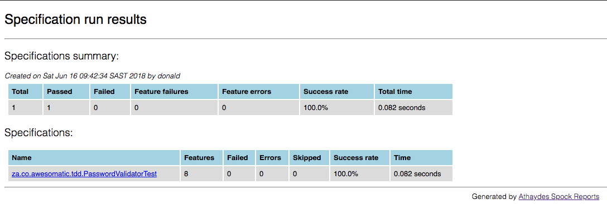
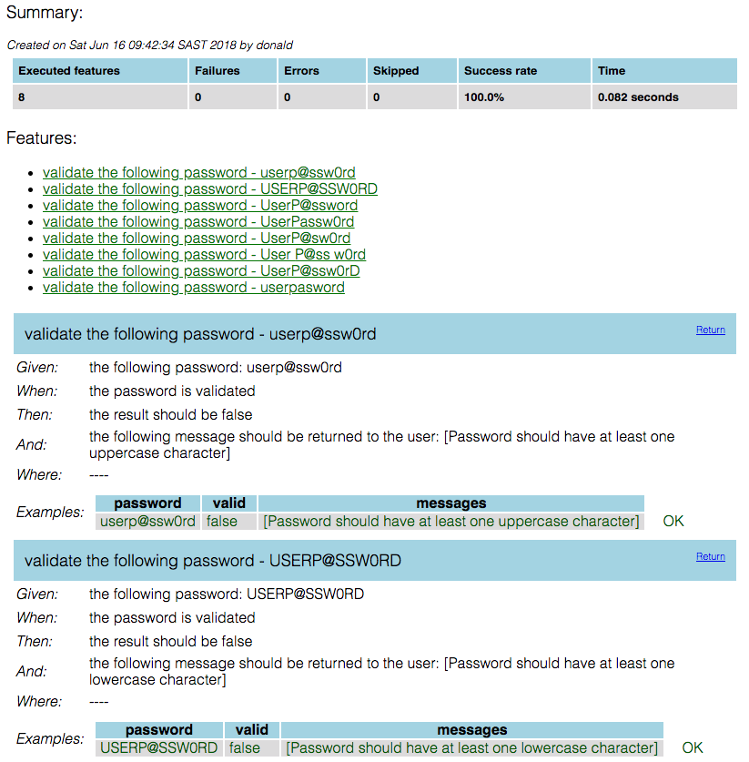

# Password Validator
In order to avoid hackers compromising member accounts, your business owner has asked you to implement a password
validation component that satisfies the acceptance criteria detailed below.
##### Acceptance Criteria
1. The password should have at least one uppercase character
2. The password should have at least one lowercase character
3. The password should have at least one digit
4. The password should have at least one special character
5. The password should be at least 12 characters long
6. The password should not have any whitespaces

If a user enters a non-compliant password, the component should return a message notifying the user of what is wrong
with the given password. The returned message should be similar to the corresponding description in the acceptance
criteria.

**HINT:**
* This is the complete list of ASCII Special Character - !"#$%&'()*+,-.\:;<=>?@[/]^_`{|}~ and this can be
  represented by the following regular expression [^a-zA-Z0–9]

# Solution
The solution to this requirement is comprehensively documented in a 2 part TDD Kata series
1. [A Comprehensive TDD Kata](https://medium.com/@donaldsiziba/a-comprehensive-tdd-kata-b453ba60c7bc?source=friends_link&sk=e1e5a028a6ca3635714ff31cb6057de6)
2. [A Comprehensive TDD Kata 2](https://medium.com/@donaldsiziba/a-comprehensive-tdd-kata-2-c8a44a00c1be?source=friends_link&sk=958675be58260bd4b51f5e94a826835d)

## Execute the build
To run the build, simply type the following in command line:
```bash
mvn test
```

## Spock Reports
After the build has run, the test reports can be found in _target/spock-reports_. Use a browser to view the _index.html_ file.
### Specifications Summary Page

### Feature Summary Page
