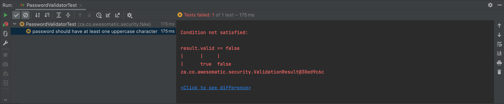

# Password Validator
In order to avoid hackers compromising member accounts, your business owner has asked you to implement a password
validation component that satisfies the acceptance criteria detailed below.
##### Acceptance Criteria
1. Password should have at least one uppercase character
2. Password should have at least one lowercase character
3. Password should have at least one digit
4. Password should have at least one special character
5. Password should be at least 12 characters long
6. Password should not have any whitespaces  

In the case of a user entering a non-compliant password, the component should return a message notifying the user what
is wrong with the given password. The returned message should be similar to the corresponding description in the
acceptance criteria.

**HINT:**  
* This is the complete list of ASCII Special Characters - !"#$%&'()*+,-.\\:;<=>?@[/]^_`{|}~ and this can be represented by the following regular expression [^a-zA-Z0-9]
* This component will be integrated to a Client via an API.

>Note: Click [here](https://github.com/donaldsiziba/password-validator#execute-the-build) for details on how to run the build.

# Solution
Normal developer instinct would dictate that you straight away write the implementation without the test case, but that is not the way how **Test Driven Development** (TDD) works...

# TDD Primer
The basic premise of TDD is that you write a test before writing the code that actually provides the implementation, and then you refactor that implementation as needed.
## The TDD 3-phase cycle
When TDD practitioners need to implement a feature, they first write a failing test that describes, or specifies, that feature. Next, they write just enough code to make the test pass. Finally, they refactor the code to help ensure that it will be easy to maintain.  


Let us see how TDD techniques can be applied to fulfil the requirements given above.

## High Level Component Design
Let us start with the high-level design of the component.  


### Validation Data Value Object
```java
public class ValidationData {
    private final String password;

    public ValidationData(final String password) {
        this.password = password;
    }

    public String getPassword() {
        return password;
    }
}
```

### Validation Result Value Object
```java
public class ValidationResult {
    private final boolean valid;
    private final List<String> messages;

    public ValidationResult(final boolean valid, final List<String> messages) {
        this.valid = valid;
        this.messages = messages;
    }

    public boolean isValid() {
        return valid;
    }

    public List<String> getMessages() {
        return Collections.unmodifiableList(messages);
    }
}
```

### Password Validator Component
Create the component class with the _happy day scenario_ as the implementation.

```java
import za.co.awesomatic.tdd.vo.ValidationResult;

import java.util.ArrayList;

public class PasswordValidator {
   public ValidationResult validate(ValidationData validationData) {
      return new ValidationResult(true, new ArrayList<>());
   }
}
```
## The First Test Criteria
### Password should have at least one uppercase character
### JUnit
```java
public class PasswordValidatorTestCase {
    PasswordValidator passwordValidator;

    @Before
    public void setUp() {
        passwordValidator = new PasswordValidator();
    }

    @Test
    public void password_should_have_at_least_one_uppercase_character() {
        String password = "userp@ssw0rd";

        ValidationResult result = passwordValidator.validate(new ValidationData(password));

        assertFalse(result.isValid());
        assertArrayEquals(result.getMessages().toArray(), new String[] {"Password should have at least one uppercase character"});
    }
}
```
#### Spock
```groovy
class PasswordValidatorTest extends Specification {
    PasswordValidator passwordValidator

    def setup() {
        passwordValidator = new PasswordValidator()
    }

    def "password should have at least one uppercase character"() {
        given: "the following password"
            String password = "userp@ssw0rd"

        when: "the password is validated"
            ValidationResult result = passwordValidator.validate(new ValidationData(password))

        then: "the password should be invalid"
            result.valid == false

        and: "the user should be notified that the password has no uppercase character"
            result.messages == ["Password should have at least one uppercase character"]
    }
}
```
### No Uppercase Failing Test Case

### No Uppercase Implementation
The solution involves pattern matching string expressions so it makes sense to use [Regular Expressions](https://en.wikipedia.org/wiki/Regular_expression).
```java
public class PasswordValidator  {
    public ValidationResult validate(ValidationData validationData) {
        List<String> messages = new ArrayList<>();
        boolean isUppercaseCharacterPresent = validationData.getPassword().matches(".*[A-Z].*");
        if(!isUppercaseCharacterPresent) {
            messages.add("Password should have at least one uppercase character");
        }
        return new ValidationResult(messages.isEmpty(), messages);
    }
}
```
### No Uppercase Passing Test Case

### Refactor No Uppercase Implementation
The *isUppercaseCharacterPresent* variable can be extracted into a method.
```java
public class PasswordValidator  {
    public ValidationResult validate(ValidationData validationData) {
        List<String> messages = new ArrayList<>();
        if(!isUppercaseCharacterPresent(validationData)) {
            messages.add("Password should have at least one uppercase character");
        }
        return new ValidationResult(messages.isEmpty(), messages);
    }

    private boolean isUppercaseCharacterPresent(ValidationData validationData) {
        return validationData.getPassword().matches(".*[A-Z].*");
    }
}
```
**Please NOTE:** Run your test to make sure it still passes.
## The Second Test Criteria
### Password should have at least one lowercase character
#### JUnit
```java
public class PasswordValidatorTestCase {
    PasswordValidator passwordValidator;

    @Before
    public void setUp() {
        passwordValidator = new PasswordValidator();
    }

    @Test
    public void password_should_have_at_least_one_uppercase_character() {
        String password = "userp@ssw0rd";

        ValidationResult result = passwordValidator.validate(new ValidationData(password));

        assertFalse(result.isValid());
        assertArrayEquals(result.getMessages().toArray(), new String[] {"Password should have at least one uppercase character"});
    }

    @Test
    public void password_should_have_at_least_one_lowercase_character() {
        String password = "USERP@SSW0RD";

        ValidationResult result = passwordValidator.validate(new ValidationData(password));

        assertFalse(result.isValid());
        assertArrayEquals(result.getMessages().toArray(), new String[] {"Password should have at least one lowercase character"});
    }
}

```
#### Spock
```groovy
class PasswordValidatorTest extends Specification {
    PasswordValidator passwordValidator

    def setup() {
        passwordValidator = new PasswordValidator()
    }

    def "password should have at least one uppercase character"() {
        given: "the following password"
            String password = "userp@ssw0rd"

        when: "the password is validated"
            ValidationResult result = passwordValidator.validate(new ValidationData(password))

        then: "the password should be invalid"
            result.valid == false

        and: "the user should be notified that the password has no uppercase character"
            result.messages == ["Password should have at least one uppercase character"]
    }

    def "password should have at least one lowercase character"() {
        given: "the following password"
            String password = "USERP@SSW0RD"

        when: "the password is validated"
            ValidationResult result = passwordValidator.validate(new ValidationData(password))

        then: "the password should be invalid"
            result.valid == false

        and: "the user should be notified that the password has no lowercase character"
            result.messages == ["Password should have at least one lowercase character"]
    }
}
```
Do you notice from the 2 test cases that there is test code duplication, this will be addressed later using the **Parameterized Test Pattern**.

### No Lowercase Failing Test Case


### No Lowercase Implementation
```java
public class PasswordValidator  {
    public ValidationResult validate(ValidationData validationData) {
        List<String> messages = new ArrayList<>();
        if(!isUppercaseCharacterPresent(validationData)) {
            messages.add("Password should have at least one uppercase character");
        }
        if(!isLowerCaseCharacterPresent(validationData)) {
            messages.add("Password should have at least one lowercase character");
        }
        return new ValidationResult(messages.isEmpty(), messages);
    }

    private boolean isUppercaseCharacterPresent(ValidationData validationData) {
        return validationData.getPassword().matches(".*[A-Z].*");
    }

    private boolean isLowerCaseCharacterPresent(ValidationData validationData) {
        return validationData.getPassword().matches(".*[a-z].*");
    }
}
```
### No Lowercase Passing Test Case


### Back to the Drawing Board
If you look carefully at the methods *isUpperCasePresent* and *isLowerCasePresent* you will notice that there is Code Duplication. This is not what you want in your code. It breaks one of the [Four Rules of Simple Design](https://dzone.com/articles/4-rules-simple-design)  
*Simple Code* is defined by the following traits:
1. Passes all the tests
2. Clear, Expressive & Consistent
3. Contains No Duplication aka DRY (Don't Repeat Yourself)
4. Minimal number of classes, methods and other moving Parts

Looking at these 2 methods they take in a parameter, perform an action on it and return *true* or *false* depending on the values in the given parameter. It can be thought of as a function that returns a value that is either *true* or *false*.

Java 8 comes with several new functional interfaces in the package *java.util.function*. One of the interfaces is a *Predicate*. This interface returns a boolean value based on an input of type **T**.
```java
package java.util.function;
import java.util.Objects;
@FunctionalInterface
public interface Predicate<T> {
 boolean test(T t);
}
```  
A *Predicate* can therefore be used as the assignment target for a [lambda expression](https://howtodoinjava.com/java-8/complete-lambda-expressions-tutorial-in-java/)
### Refactor Password Validator Component to use Predicates
```java
public class PasswordValidator  {
    private Predicate<ValidationData> isUppercaseCharacterPresent = validationData -> validationData.getPassword().matches(".*[A-Z].*");
    private Predicate<ValidationData> isLowerCaseCharacterPresent = validationData -> validationData.getPassword().matches(".*[a-z].*");

    public ValidationResult validate(ValidationData validationData) {
        List<String> messages = new ArrayList<>();
        if(!isUppercaseCharacterPresent.test(validationData)) {
            messages.add("Password should have at least one uppercase character");
        }
        if(!isLowerCaseCharacterPresent.test(validationData)) {
            messages.add("Password should have at least one lowercase character");
        }
        return new ValidationResult(messages.isEmpty(), messages);
    }
}
```  
**Please NOTE:** Run your tests and make sure they still pass.  

Let's update the PasswordValidator class diagram to represent our current implementation.  

### Push Left Design Principle
The 2 *Predicate* variables can be "pushed to the left" and the variables in question will be abstracted into a collection on the *PasswordValidator* component.
  
Update the code to match the Password Validator Class Diagram
```java
public class PasswordValidator  {
    private List<Predicate<ValidationData>> rules = new ArrayList<>();

    public ValidationResult validate(ValidationData validationData) {
        List<String> messages = new ArrayList<>();
        if(!isUppercaseCharacterPresent.test(validationData)) {
            messages.add("Password should have at least one uppercase character");
        }
        if(!isLowerCaseCharacterPresent.test(validationData)) {
            messages.add("Password should have at least one lowercase character");
        }
        return new ValidationResult(messages.isEmpty(), messages);
    }
}
```
The code now gives compile errors because the *Predicate* variables have been abstracted into a collection. The design still needs to be refined.
### Pull Up Design Principle
To cater for the *Regular Expressions* and *Notification Messages*, we need a class that derives from *Predicate* that will take into consideration both of these concerns.  
We can also take this chance to extract a Password Validator interface. *Programming to an interface* is a key design principle that results in loose coupling between modules or systems.  


### Validation Rule Interface
```java
public interface ValidationRule extends Predicate<ValidationData> {
    String getMessage();
}
```
### Regex Validation Rule Class
```java
public class RegexValidationRule implements ValidationRule {
    private final String regex;
    private final String message;

    public RegexValidationRule(final String regex, final String message) {
        this.regex = regex;
        this.message = message;
    }

    @Override
    public String getMessage() {
        return message;
    }

    @Override
    public boolean test(ValidationData validationData) {
        return validationData.getPassword().matches(regex);
    }
}
```
### Password Validator Interface
```java
public interface PasswordValidator {
    ValidationResult validate(ValidationData validationData);
}
```
### Password Validator Concrete Implementation
```java
public class RuleBasedPasswordValidator implements PasswordValidator {
  private List<ValidationRule> rules = new ArrayList<ValidationRule>() {{
      add(new RegexValidationRule(".*[A-Z].*", "Password should have at least one uppercase character"));
      add(new RegexValidationRule(".*[a-z].*", "Password should have at least one lowercase character"));
  }};

  @Override
  public ValidationResult validate(final ValidationData validationData) {
    List<String> messages = new ArrayList<>();
    for(ValidationRule rule : rules) {
      if(!rule.test(validationData)) {
        messages.add(rule.getMessage());
      }
    }
    return new ValidationResult(messages.isEmpty(), messages);
  }   
}
```
### Refactor the Password Validator Concrete Implementation
1. Use Java 8 Idioms
    - [Streams](https://docs.oracle.com/javase/tutorial/collections/streams/index.html)
    - [Aggregation Operations](https://docs.oracle.com/javase/tutorial/collections/streams/index.html)
       * [Filter](https://docs.oracle.com/javase/tutorial/collections/streams/)
       * [Map](https://docs.oracle.com/javase/tutorial/collections/streams/)
       * [Collect](https://docs.oracle.com/javase/tutorial/collections/streams/reduction.html#collect)
    - [Method Reference](https://docs.oracle.com/javase/tutorial/java/javaOO/methodreferences.html)


```java
public class RuleBasedPasswordValidator implements PasswordValidator {
    private List<ValidationRule> rules = new ArrayList<ValidationRule>() {{
        add(new RegexValidationRule(".*[A-Z].*", "Password should have at least one uppercase character"));
        add(new RegexValidationRule(".*[a-z].*", "Password should have at least one lowercase character"));
    }};

    @Override
    public ValidationResult validate(final ValidationData validationData) {
        List<String> messages = rules.stream().filter(rule -> !rule.test(validationData))
                                              .map(ValidationRule::getMessage)
                                              .collect(toCollection(ArrayList::new));
        return new ValidationResult(messages.isEmpty(), messages);
    }
}
```
We can move the boolean negation (!) operator from the password implementation into the RegexValidatonRule.

```java
public class RegexValidationRule implements ValidationRule {
    private final String regex;
    private final String message;

    public RegexValidationRule(final String regex, final String message) {
        this.regex = regex;
        this.message = message;
    }

    @Override
    public String getMessage() {
        return message;
    }

    @Override
    public boolean test(ValidationData validationData) {
        return !validationData.getPassword().matches(regex);
    }
}
```

```java
public class RuleBasedPasswordValidator implements PasswordValidator  {
    private List<ValidationRule> rules = new ArrayList<ValidationRule>() {{
        add(new RegexValidationRule(".*[A-Z].*", "Password should have at least one uppercase character"));
        add(new RegexValidationRule(".*[a-z].*", "Password should have at least one lowercase character"));
    }};

    @Override
    public ValidationResult validate(final ValidationData validationData) {
        List<String> messages = rules.stream().filter(rule -> rule.test(validationData))
                                              .map(ValidationRule::getMessage)
                                              .collect(toCollection(ArrayList::new));
        return new ValidationResult(messages.isEmpty(), messages);
    }
}
```
**Please NOTE:** Run your tests and make sure they still pass.

### Parameterized Test Pattern
A [Parameterized Test](https://en.wikipedia.org/wiki/Unit_testing#Parameterized_unit_testing) offers a way to reuse the same test logic for multiple test scenarios. This is a perfect pattern to use whenever there is *Test Code Duplication* resulting in several tests implementing the same test code but with slightly different data.  
### JUnit Parameterized Test
```java
@RunWith(Parameterized.class)
public class PasswordValidatorTestCase {
    @Parameterized.Parameters(name= "{index}: validate({0})")
    public static Collection<Object[]> data() {
        return Arrays.asList(new Object[][] {
                {"userp@ssw0rd", false, new String[] {"Password should have at least one uppercase character"}},
                {"USERP@SSW0RD", false, new String[] {"Password should have at least one lowercase character"}}
        });
    }

    private String password;
    private boolean valid;
    private String[] messages;

    PasswordValidator passwordValidator;

    public PasswordValidatorTestCase(String password, boolean valid, String[] messages) {
        this.password = password;
        this.valid = valid;
        this.messages = messages;
    }

    @Before
    public void setUp() {
        passwordValidator = new RuleBasedPasswordValidator();
    }

    @Test
    public void validatePassword() {
        ValidationResult result = passwordValidator.validate(new ValidationData(password));

        assertEquals(result.isValid(), valid);
        assertArrayEquals(result.getMessages().toArray(), messages);
    }
}
```
### Tabular Data Input with Spock
Spock enables you to directly embed a table as-is inside your Groovy code. The following code snippet shows how this is done in the current context.
```java
class PasswordValidatorTest extends Specification {
    PasswordValidator passwordValidator

    def setup() {
        passwordValidator = new RulePasswordValidator()
    }

    @Unroll
    def "validate the following password - #password"() {
        given: "the following password: #password"

        when: "the password is validated"
            ValidationResult result = passwordValidator.validate(new ValidationData(password))

        then: "the result should be #valid"
            result.valid == valid

        and: "the following message should be returned to the user: #messages"
            result.messages == messages

        where:
            password           || valid | messages
            'userp@ssw0rd'     || false | ['Password should have at least one uppercase character']
            'USERP@SSW0RD'     || false | ['Password should have at least one lowercase character']
    }
}
```
The key point of this unit test is the **where:** label (in addition to the usual **given-then-when** labels) that holds a definition of all inputs/outputs used in the other blocks. In the where: block of this Spock test, I copied verbatim the password validation scenarios into the table. The **||** notation is used to split the inputs from outputs. The **@Unroll** annotation, "unrolls" the test scenarios and presents them to the test runner as individual tests.  
**Please NOTE:** Run your tests and make sure they still pass.

From here we can proceed and define the remainder of the test scenarios and their corresponding implementations.
## The Third Test Criteria
### Password should have at least one digit
### Junit
```java
public class PasswordValidatorTestCase {
    @Parameterized.Parameters(name= "{index}: validate({0})")
    public static Collection<Object[]> data() {
        return Arrays.asList(new Object[][] {
                {"userp@ssw0rd", false, new String[] {"Password should have at least one uppercase character"}},
                {"USERP@SSW0RD", false, new String[] {"Password should have at least one lowercase character"}},
                {"UserP@ssword", false, new String[] {"Password should have at least one digit"}}
        });
    }

    private String password;
    private boolean valid;
    private String[] messages;

    PasswordValidator passwordValidator;

    public PasswordValidatorTestCase(String password, boolean valid, String[] messages) {
        this.password = password;
        this.valid = valid;
        this.messages = messages;
    }

    @Before
    public void setUp() {
        passwordValidator = new RuleBasedPasswordValidator();
    }

    @Test
    public void validatePassword() {
        ValidationResult result = passwordValidator.validate(new ValidationData(password));

        assertEquals(result.isValid(), valid);
        assertArrayEquals(result.getMessages().toArray(), messages);
    }
}
```
#### Spock
```groovy
class PasswordValidatorTest extends Specification {
    PasswordValidator passwordValidator

    def setup() {
        passwordValidator = new RuleBasedPasswordValidator()
    }

    @Unroll
    def "validate the following password - #password"() {
        given: "the following password: #password"

        when: "the password is validated"
            ValidationResult result = passwordValidator.validate(new ValidationData(password))

        then: "the result should be #valid"
            result.valid == valid

        and: "the following message should be returned to the user: #messages"
            result.messages == messages

        where:
            password           || valid | messages
            'userp@ssw0rd'     || false | ['Password should have at least one uppercase character']
            'USERP@SSW0RD'     || false | ['Password should have at least one lowercase character']
            'UserP@ssword'     || false | ['Password should have at least one digit']
    }
}
```
### No Digit Failing Test Case

### No Digit Implementation
```java
public class RuleBasedPasswordValidator implements PasswordValidator  {
    private List<ValidationRule> rules = new ArrayList<ValidationRule>() {{
        add(new RegexValidationRule(".*[A-Z].*", "Password should have at least one uppercase character"));
        add(new RegexValidationRule(".*[a-z].*", "Password should have at least one lowercase character"));
        add(new RegexValidationRule(".*[0-9].*", "Password should have at least one digit"));
    }};

    @Override
    public ValidationResult validate(final ValidationData validationData) {
        List<String> messages = rules.stream().filter(rule -> rule.test(validationData))
                                              .map(ValidationRule::getMessage)
                                              .collect(toCollection(ArrayList::new));
        return new ValidationResult(messages.isEmpty(), messages);
    }
}
```
### No Digit Passing Test Case

## The Fourth Test Criteria
### Password should have at least one special character
#### JUnit
```java
@RunWith(Parameterized.class)
public class PasswordValidatorTestCase {
    @Parameterized.Parameters(name= "{index}: validate({0})")
    public static Collection<Object[]> data() {
        return Arrays.asList(new Object[][] {
                {"userp@ssw0rd", false, new String[] {"Password should have at least one uppercase character"}},
                {"USERP@SSW0RD", false, new String[] {"Password should have at least one lowercase character"}},
                {"UserP@ssword", false, new String[] {"Password should have at least one digit"}},
                {"UserPassw0rd", false, new String[] {"Password should have at least one special character"}}
        });
    }

    private String password;
    private boolean valid;
    private String[] messages;

    PasswordValidator passwordValidator;

    public PasswordValidatorTestCase(String password, boolean valid, String[] messages) {
        this.password = password;
        this.valid = valid;
        this.messages = messages;
    }

    @Before
    public void setUp() {
        passwordValidator = new RuleBasedPasswordValidator();
    }

    @Test
    public void validatePassword() {
        ValidationResult result = passwordValidator.validate(new ValidationData(password));

        assertEquals(result.isValid(), valid);
        assertArrayEquals(result.getMessages().toArray(), messages);
    }
}
```

#### Spock
```groovy
class PasswordValidatorTest extends Specification {
    PasswordValidator passwordValidator

    def setup() {
        passwordValidator = new RuleBasedPasswordValidator()
    }

    @Unroll
    def "validate the following password - #password"() {
        given: "the following password: #password"

        when: "the password is validated"
            ValidationResult result = passwordValidator.validate(new ValidationData(password))

        then: "the result should be #valid"
            result.valid == valid

        and: "the following message should be returned to the user: #messages"
            result.messages == messages

        where:
            password           || valid | messages
            'userp@ssw0rd'     || false | ['Password should have at least one uppercase character']
            'USERP@SSW0RD'     || false | ['Password should have at least one lowercase character']
            'UserP@ssword'     || false | ['Password should have at least one digit']
            'UserPassw0rd'     || false | ['Password should have at least one special character']
    }
}
```
### No Special Character Failing Test Case
  
### No Special Character Implementation
```java
public class RuleBasedPasswordValidator implements PasswordValidator  {
    private List<ValidationRule> rules = new ArrayList<ValidationRule>() {{
        add(new RegexValidationRule(".*[A-Z].*", "Password should have at least one uppercase character"));
        add(new RegexValidationRule(".*[a-z].*", "Password should have at least one lowercase character"));
        add(new RegexValidationRule(".*[0-9].*", "Password should have at least one digit"));
        add(new RegexValidationRule(".*[^a-zA-Z0-9].*", "Password should have at least one special character"));
    }};

    @Override
    public ValidationResult validate(final ValidationData validationData) {
        List<String> messages = rules.stream().filter(rule -> rule.test(validationData))
                                              .map(ValidationRule::getMessage)
                                              .collect(toCollection(ArrayList::new));
        return new ValidationResult(messages.isEmpty(), messages);
    }
}
```
### No Special Character Passing Testing Case

## The Fifth Test Criteria
### Password should be at least 12 characters long
#### JUnit
```java
@RunWith(Parameterized.class)
public class PasswordValidatorTestCase {
    @Parameterized.Parameters(name= "{index}: validate({0})")
    public static Collection<Object[]> data() {
        return Arrays.asList(new Object[][] {
                {"userp@ssw0rd", false, new String[] {"Password should have at least one uppercase character"}},
                {"USERP@SSW0RD", false, new String[] {"Password should have at least one lowercase character"}},
                {"UserP@ssword", false, new String[] {"Password should have at least one digit"}},
                {"UserPassw0rd", false, new String[] {"Password should have at least one special character"}},
                {"UserP@sw0rd", false, new String[] {"Password should be at least 12 characters long"}}
        });
    }

    private String password;
    private boolean valid;
    private String[] messages;

    PasswordValidator passwordValidator;

    public PasswordValidatorTestCase(String password, boolean valid, String[] messages) {
        this.password = password;
        this.valid = valid;
        this.messages = messages;
    }

    @Before
    public void setUp() {
        passwordValidator = new RuleBasedPasswordValidator();
    }

    @Test
    public void validatePassword() {
        ValidationResult result = passwordValidator.validate(new ValidationData(password));

        assertEquals(result.isValid(), valid);
        assertArrayEquals(result.getMessages().toArray(), messages);
    }
}
```
#### Spock
```groovy
class PasswordValidatorTest extends Specification {
    PasswordValidator passwordValidator

    def setup() {
        passwordValidator = new RuleBasedPasswordValidator()
    }

    @Unroll
    def "validate the following password - #password"() {
        given: "the following password: #password"

        when: "the password is validated"
            ValidationResult result = passwordValidator.validate(new ValidationData(password))

        then: "the result should be #valid"
            result.valid == valid

        and: "the following message should be returned to the user: #messages"
            result.messages == messages

        where:
            password           || valid | messages
            'userp@ssw0rd'     || false | ['Password should have at least one uppercase character']
            'USERP@SSW0RD'     || false | ['Password should have at least one lowercase character']
            'UserP@ssword'     || false | ['Password should have at least one digit']
            'UserPassw0rd'     || false | ['Password should have at least one special character']
            'UserP@sw0rd'      || false | ['Password should be at least 12 characters long']
    }
}
```
### Password Length Does NOT Exceed 12 Characters Failing Test Case

### Password Length Does NOT Exceed 12 Characters Implementation
```java
public class RuleBasedPasswordValidator implements PasswordValidator  {
    private List<ValidationRule> rules = new ArrayList<ValidationRule>() {{
        add(new RegexValidationRule(".*[A-Z].*", "Password should have at least one uppercase character"));
        add(new RegexValidationRule(".*[a-z].*", "Password should have at least one lowercase character"));
        add(new RegexValidationRule(".*[0-9].*", "Password should have at least one digit"));
        add(new RegexValidationRule(".*[^a-zA-Z0-9].*", "Password should have at least one special character"));
        add(new RegexValidationRule(".{12,}", "Password should be at least 12 characters long"));
    }};

    @Override
    public ValidationResult validate(final ValidationData validationData) {
        List<String> messages = rules.stream().filter(rule -> rule.test(validationData))
                                              .map(ValidationRule::getMessage)
                                              .collect(toCollection(ArrayList::new));
        return new ValidationResult(messages.isEmpty(), messages);
    }
}
```
### Password Length Does NOT Exceed 12 Characters Passing Test Case

## The Sixth Test Criteria
### Password should not have any whitespace
#### JUnit
```java
@RunWith(Parameterized.class)
public class PasswordValidatorTestCase {
    @Parameterized.Parameters(name= "{index}: validate({0})")
    public static Collection<Object[]> data() {
        return Arrays.asList(new Object[][] {
                {"userp@ssw0rd", false, new String[] {"Password should have at least one uppercase character"}},
                {"USERP@SSW0RD", false, new String[] {"Password should have at least one lowercase character"}},
                {"UserP@ssword", false, new String[] {"Password should have at least one digit"}},
                {"UserPassw0rd", false, new String[] {"Password should have at least one special character"}},
                {"UserP@sw0rd", false, new String[] {"Password should be at least 12 characters long"}},
                {"User   P@ss w0rd", false, new String[] {"Password should not have any whitespaces"}}
        });
    }

    private String password;
    private boolean valid;
    private String[] messages;

    PasswordValidator passwordValidator;

    public PasswordValidatorTestCase(String password, boolean valid, String[] messages) {
        this.password = password;
        this.valid = valid;
        this.messages = messages;
    }

    @Before
    public void setUp() {
        passwordValidator = new PasswordValidator();
    }

    @Test
    public void validatePassword() {
        ValidationResult result = passwordValidator.validate(new ValidationData(password));

        assertEquals(result.isValid(), valid);
        assertArrayEquals(result.getMessages().toArray(), messages);
    }
}
```
#### Spock
```groovy
class PasswordValidatorTest extends Specification {
    PasswordValidator passwordValidator

    def setup() {
        passwordValidator = new PasswordValidator()
    }

    @Unroll
    def "validate the following password - #password"() {
        given: "the following password: #password"

        when: "the password is validated"
            ValidationResult result = passwordValidator.validate(new ValidationData(password))

        then: "the result should be #valid"
            result.valid == valid

        and: "the following message should be returned to the user: #messages"
            result.messages == messages

        where:
            password           || valid | messages
            'userp@ssw0rd'     || false | ['Password should have at least one uppercase character']
            'USERP@SSW0RD'     || false | ['Password should have at least one lowercase character']
            'UserP@ssword'     || false | ['Password should have at least one digit']
            'UserPassw0rd'     || false | ['Password should have at least one special character']
            'UserP@sw0rd'      || false | ['Password should be at least 12 characters long']
            'User   P@ss w0rd' || false | ['Password should not have any whitespaces']
    }
}
```
### Password with Whitespace Failing Test Case

### Password with Whitespace implementation
```java
public class RuleBasedPasswordValidator implements PasswordValidator  {
    private List<ValidationRule> rules = new ArrayList<ValidationRule>() {{
        add(new RegexValidationRule(".*[A-Z].*", "Password should have at least one uppercase character"));
        add(new RegexValidationRule(".*[a-z].*", "Password should have at least one lowercase character"));
        add(new RegexValidationRule(".*[0-9].*", "Password should have at least one digit"));
        add(new RegexValidationRule(".*[^a-zA-Z0-9].*", "Password should have at least one special character"));
        add(new RegexValidationRule(".{12,}", "Password should be at least 12 characters long"));
        add(new RegexValidationRule("\\S+$", "Password should not have any whitespaces"));
    }};

    @Override
    public ValidationResult validate(final ValidationData validationData) {
        List<String> messages = rules.stream().filter(rule -> rule.test(validationData))
                                              .map(ValidationRule::getMessage)
                                              .collect(toCollection(ArrayList::new));
        return new ValidationResult(messages.isEmpty(), messages);
    }
}
```
### Password with Whitespace Passing Test Case

## The Seventh Test Criteria
### Happy Day Scenario
We can finally test the **Happy Day Scenario**
#### JUnit
```java
@RunWith(Parameterized.class)
public class PasswordValidatorTestCase {
    @Parameterized.Parameters(name= "{index}: validate({0})")
    public static Collection<Object[]> data() {
        return Arrays.asList(new Object[][] {
                {"userp@ssw0rd", false, new String[] {"Password should have at least one uppercase character"}},
                {"USERP@SSW0RD", false, new String[] {"Password should have at least one lowercase character"}},
                {"UserP@ssword", false, new String[] {"Password should have at least one digit"}},
                {"UserPassw0rd", false, new String[] {"Password should have at least one special character"}},
                {"UserP@sw0rd", false, new String[] {"Password should be at least 12 characters long"}},
                {"User   P@ss w0rd", false, new String[] {"Password should not have any whitespaces"}},
                {"UserP@ssw0rD", true, new String[] {}}
        });
    }

    private String password;
    private boolean valid;
    private String[] messages;

    PasswordValidator passwordValidator;

    public PasswordValidatorTestCase(String password, boolean valid, String[] messages) {
        this.password = password;
        this.valid = valid;
        this.messages = messages;
    }

    @Before
    public void setUp() {
        passwordValidator = new PasswordValidator();
    }

    @Test
    public void validatePassword() {
        ValidationResult result = passwordValidator.validate(new ValidationData(password));

        assertEquals(result.isValid(), valid);
        assertArrayEquals(result.getMessages().toArray(), messages);
    }
}
```
#### Spock
```groovy
class PasswordValidatorTest extends Specification {
    PasswordValidator passwordValidator

    def setup() {
        passwordValidator = new PasswordValidator()
    }

    @Unroll
    def "validate the following password - #password"() {
        given: "the following password: #password"

        when: "the password is validated"
            ValidationResult result = passwordValidator.validate(new ValidationData(password))

        then: "the result should be #valid"
            result.valid == valid

        and: "the following message should be returned to the user: #messages"
            result.messages == messages

        where:
            password           || valid | messages
            'userp@ssw0rd'     || false | ['Password should have at least one uppercase character']
            'USERP@SSW0RD'     || false | ['Password should have at least one lowercase character']
            'UserP@ssword'     || false | ['Password should have at least one digit']
            'UserPassw0rd'     || false | ['Password should have at least one special character']
            'UserP@sw0rd'      || false | ['Password should be at least 12 characters long']
            'User   P@ss w0rd' || false | ['Password should not have any whitespaces']
            'UserP@ssw0rD'     || true  | []
    }
}
```
Because the password *UserP@ssw0rD* meets all the previous criteria, all the test cases pass.

## The Eighth Test Scenario
### Password violates multiple of the Password Compliance Rules
#### JUnit
```java
@RunWith(Parameterized.class)
public class PasswordValidatorTestCase {
    @Parameterized.Parameters(name= "{index}: validate({0})")
    public static Collection<Object[]> data() {
        return Arrays.asList(new Object[][] {
                {"userp@ssw0rd", false, new String[] {"Password should have at least one uppercase character"}},
                {"USERP@SSW0RD", false, new String[] {"Password should have at least one lowercase character"}},
                {"UserP@ssword", false, new String[] {"Password should have at least one digit"}},
                {"UserPassw0rd", false, new String[] {"Password should have at least one special character"}},
                {"UserP@sw0rd", false, new String[] {"Password should be at least 12 characters long"}},
                {"User   P@ss w0rd", false, new String[] {"Password should not have any whitespaces"}},
                {"UserP@ssw0rD", true, new String[] {}},
                {"userpasword", false, new String[] {"Password should have at least one uppercase character", "Password should have at least one digit",
                        "Password should have at least one special character", "Password should be at least 12 characters long"}}
        });
    }

    private String password;
    private boolean valid;
    private String[] messages;

    PasswordValidator passwordValidator;

    public PasswordValidatorTestCase(String password, boolean valid, String[] messages) {
        this.password = password;
        this.valid = valid;
        this.messages = messages;
    }

    @Before
    public void setUp() {
        passwordValidator = new PasswordValidator();
    }

    @Test
    public void validatePassword() {
        ValidationResult result = passwordValidator.validate(new ValidationData(password));

        assertEquals(result.isValid(), valid);
        assertArrayEquals(result.getMessages().toArray(), messages);
    }
}
```
#### Spock
```groovy
class PasswordValidatorTest extends Specification {
    PasswordValidator passwordValidator

    def setup() {
        passwordValidator = new PasswordValidator()
    }

    @Unroll
    def "validate the following password - #password"() {
        given: "the following password: #password"

        when: "the password is validated"
            ValidationResult result = passwordValidator.validate(new ValidationData(password))

        then: "the result should be #valid"
            result.valid == valid

        and: "the following message should be returned to the user: #messages"
            result.messages == messages

        where:
            password           || valid | messages
            'userp@ssw0rd'     || false | ['Password should have at least one uppercase character']
            'USERP@SSW0RD'     || false | ['Password should have at least one lowercase character']
            'UserP@ssword'     || false | ['Password should have at least one digit']
            'UserPassw0rd'     || false | ['Password should have at least one special character']
            'UserP@sw0rd'      || false | ['Password should be at least 12 characters long']
            'User   P@ss w0rd' || false | ['Password should not have any whitespaces']
            'UserP@ssw0rD'     || true  | []
            'userpasword'      || false | ['Password should have at least one uppercase character','Password should have at least one digit','Password should have at least one special character','Password should be at least 12 characters long']
    }
```
### Multiple Violations Passing Test Case


## Execute the build
To run the build, simply type the following in command line:
```bash
mvn test
```

## Spock Reports
After the build has run, the test reports can be found in _target/spock-reports_. Use a browser to view the _index.html_ file.
### Specifications Summary Page

### Feature Summary Page
